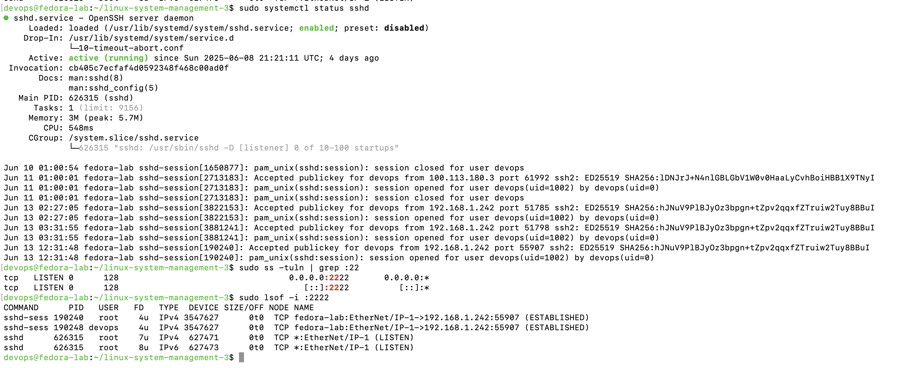
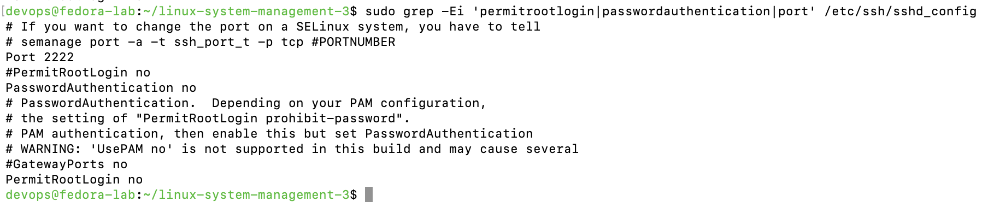
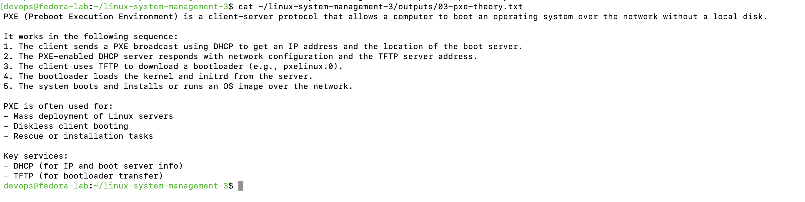
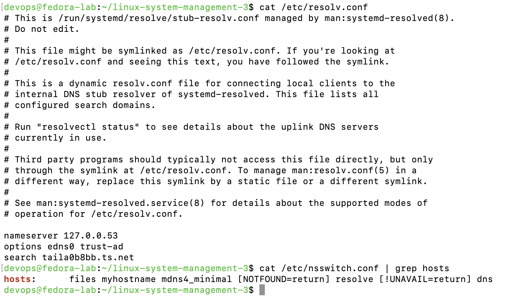
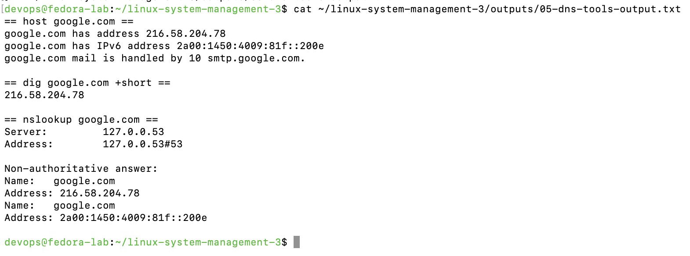

# 🛰️ linux-system-management-3

> **Project 3 of 3** in the Linux System Management series  
> Focus: SSH service validation, PXE basics, DNS and name resolution

---

## 📌 Objectives

- Verify and harden SSH server configuration
- Understand PXE boot role and discovery process
- Investigate DNS resolution settings and tools
- Use `host`, `dig`, and `nslookup` to resolve names and test DNS behavior

---

## 📁 Project Structure

```
linux-system-management-3/
├── README.md
├── outputs/
│   ├── 01-sshd-status.txt
│   ├── 02-sshd-config.txt
│   ├── 03-pxe-theory.txt
│   ├── 04-resolv-nsswitch.txt
│   └── 05-dns-tools-output.txt
└── screenshots/
    ├── 01-sshd-status.png
    ├── 02-sshd-config.png
    ├── 03-pxe-theory.png
    ├── 04-resolv-nsswitch.png
    └── 05-dns-tools-output.png
```

---

## ⚙️ Command Execution & Results

### 1️⃣ SSH Service Status & Port Validation

```bash
sudo systemctl status sshd
sudo ss -tuln | grep :22
```

📄 [`01-sshd-status.txt`](outputs/01-sshd-status.txt)  
📷 

---

### 2️⃣ SSHD Config Check (Hardened)

```bash
sudo grep -Ei 'permitrootlogin|passwordauthentication|port' /etc/ssh/sshd_config
```

📄 [`02-sshd-config.txt`](outputs/02-sshd-config.txt)  
📷 

---

### 3️⃣ PXE Theory Notes (Manual)

Create a markdown or text file summarizing:

- What is PXE
- How DHCP and TFTP are used
- The boot process sequence

📄 [`03-pxe-theory.txt`](outputs/03-pxe-theory.txt)  
📷 

---

### 4️⃣ DNS Resolution Files

```bash
cat /etc/resolv.conf
cat /etc/nsswitch.conf | grep hosts
```

📄 [`04-resolv-nsswitch.txt`](outputs/04-resolv-nsswitch.txt)  
📷 

---

### 5️⃣ Name Resolution Tools

```bash
host google.com
dig google.com +short
nslookup google.com
```

📄 [`05-dns-tools-output.txt`](outputs/05-dns-tools-output.txt)  
📷 

---

## ✅ Summary

This project demonstrates Linux+ exam topics for securing and verifying SSH, understanding PXE boot concepts, and managing DNS resolution. All outputs and screenshots reflect real terminal execution and audit-worthy configuration.

---

## 🎯 Linux+ Portfolio Completed

✅ `linux-system-management-1`  
✅ `linux-system-management-2`  
✅ `linux-system-management-3`

Each project reflects real-world readiness and hands-on verification.
